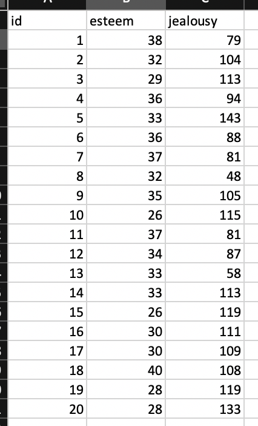

<br>

###### Getting RStudio Up and Running
* [**Installing R/RStudio**](installing.html)
* [**Getting Started with RStudio**](getting-started.html)
* [**Reading-in Data**](reading-in-data.html)

###### Univariate/Descriptive Statistics and Assessing Normality
* [**Univariate/Descriptive Statistics & Normality**](univariate-normality.html) [ <a href="https://raw.githubusercontent.com/burrelvannjr/gradstats_sdsu/main/resources/exercises/univariate-normality.R" target="_blank"><i>R Script</i></a> ]

###### Bivariate and Multivariate Statistics
* [**Independent Samples t-Test**](t-test.html) [ <a href="https://raw.githubusercontent.com/burrelvannjr/gradstats_sdsu/main/resources/exercises/t-test.R" target="_blank"><i>R Script</i></a> | [*Example*](t-test-example.html) ]
* [**One-Way Analysis of Variance (ANOVA)**](anova.html) [ <a href="https://raw.githubusercontent.com/burrelvannjr/gradstats_sdsu/main/resources/exercises/anova.R" target="_blank"><i>R Script</i></a> | [*Example*](anova-example.html) ]
* [**Chi Square Test of Independence**](chi-square.html) [ <a href="https://raw.githubusercontent.com/burrelvannjr/gradstats_sdsu/main/resources/exercises/chi-square.R" target="_blank"><i>R Script</i></a> | [*Example*](chi-square-example.html) ]
* [**Correlation**](correlation.html) [ <a href="https://raw.githubusercontent.com/burrelvannjr/gradstats_sdsu/main/resources/exercises/correlation.R" target="_blank"><i>R Script</i></a> | [*Example*](correlation-example.html) ]
* [**Regression**](regression.html) [ <a href="https://raw.githubusercontent.com/burrelvannjr/gradstats_sdsu/main/resources/exercises/regression.R" target="_blank"><i>R Script</i></a> | [*Example*](regression-example.html) ]
<br><br>


#


#### Is there a relationship between a person's jealousy and their self-esteem? 

<br>

### The correlation

The correlation ($r$) or Pearson's product-moment correlation coefficient examines the relationship between two interval-ratio variables to see if the relationship reflects a true relationship that we could expect to find in the population. The test also tells us the **strength** (weak, moderate, strong) and **direction** (positive, negative) of that relationship. Rarely, we will see a non-relationship or a perfect relationship.

For this example, the correlation works perfectly because we're looking at how a person's self-esteem (a scale ranging from 1 -- low self-esteem to 50 -- high self-esteem), an interval-ratio level variable, is related to that person's level of jealousy (a scale ranging from 50 -- low jealousy to 150 -- high jealousy), another interval-ratio variable, to see if there is a true relationship that would exist in the population.

<br>


#### Load the Necessary Stuff

```{r, echo=F}
options(repos=c(CRAN="http://cran.wustl.edu/"))
```

```{r, results="hide", warning=FALSE, message=FALSE}
library(MASS)
library(psych)
library(vannstats)
```

<br>

#### Reading in the Data

In total, we have 20 individuals. Below, is an image of their data in a spreadsheet and list their respective self-esteem scores and their jealousy scores. The data are as follows:

```{r, out.width = "200px", echo=FALSE}

```


**Self-Esteem**: <span style="color:blue">`38, 32, 29, 36, 33, 36, 37, 32, 35, 26, 37, 34, 33, 33, 26, 30, 30, 40, 28, 28`</span> 

**Jealousy**: <span style="color:blue">`79, 104, 113, 94, 143, 88, 81, 48, 105, 115, 81, 87, 58, 113, 119, 111, 109, 108, 119, 133`</span>.

<br>

As in the [Intro to R](Intro-and-Univariate-Statistics.html) vignette, we can create an object out of a list of numbers using the concatenate <span style="color:blue">`c`</span> function.

Knowing that we have two variables: esteem score (interval-ratio independent variable) and jealousy score (interval-ratio dependent variable), we have to read in the variables separately (listing the values for each observation). To do so, we can use the following code:


```{r}
esteem <- c(38, 32, 29, 36, 33, 36, 37, 32, 35, 26, 37, 34, 33, 33, 26, 30, 30, 40, 28, 28)
jealousy <- c(79, 104, 113, 94, 143, 88, 81, 48, 105, 115, 81, 87, 58, 113, 119, 111, 109, 108, 119, 133)
```

Where the first observation in esteem corresponds with the number in the first observation of jealousy. For example, the first observation in the list for <span style="color:blue">`esteem`</span> is <span style="color:blue">`38`</span>, which corresponds with the first observation in the <span style="color:blue">`jealousy`</span> list, of <span style="color:blue">`79`</span>: This means the first observation is a person with an esteem score of 38 and a jealousy score of 79. 

Next, to appropriately prepare the data for analysis using the correlation, we have to merge the two lists. To merge the data, as in the [Intro to R](Intro-and-Univariate-Statistics.html) vignette, we can use the <span style="color:blue">`data.frame`</span> function. 

```{r}
data <- data.frame(esteem,jealousy)
```

Now we can call the data... 

```{r}
data
```

<br>


### Assumptions and Diagnostics for Correlation

The assumptions for the Correlation are...

* Linearity
* Normality
* Absence of Range Restrictions
* Absence of Heterogeneous Subsamples

In addition, the previously-discussed assumptions for other tests (independence of observations) is implied, since all of these bivariate tests require random samples.

```{r, echo=FALSE}
data1 <- mtcars
```


##### 1. Linearity
* Variables move together in a linear fashion.

```{r}
scatter(data, jealousy, esteem)
```

  + <span style="color:red">Visual inspection of **scatterplot** to see if relationship is linear (straight-line). `Therefore, we meet the assumption of linearity`.</span> 

##### 2. Normality 

* Distributions must be relatively normal.
  + Visual inspection of...
    + Histograms for each variable
    + Box-and-Whiskers plot for each variable
    + Normality (Q-Q) plot for each variable

##### 2a. Histogram

```{r, warning=FALSE}
hst(data, jealousy)
```

```{r, warning=FALSE}
hst(data, esteem)
```

  + <span style="color:red">We can see from the histogram that for both variables, the data are moderately negatively skewed. It is safe to assume, however, that these data are close enough to normal to proceed with the statistical test.</span> 

##### 2b. Box-and-Whisker Plots

```{r}
box(data, jealousy)
```

```{r}
box(data, esteem)
```

  + <span style="color:red">We can see from the boxplot that for both variables, the data are somewhat normally distributed. Although, for the jealousy variable, the median is closer to the upper end (75$^{th}$ percentile) of the interquartile range than the middle. Despite this trend, it is safe to assume that these data are close enough to normal, since they aren't *drastically* different from normal, and therefore safe to proceed with the statistical test.</span>
  
##### 2c. Normality (Q-Q) Plots

```{r}
qq(data, jealousy)
```

```{r}
qq(data, esteem)
```

  + <span style="color:red">We can see from the Q-Q plot that for both variable, the data are somewhat normal, since there is no discernible pattern across the line (e.g. no strong curvilinear trend around normality line). It is therefore safe to proceed with the statistical test.</span> 

<br>

  + <span style="color:red">Based on the the three visual depictions above, the data seem normally-distributed. `Therefore, we meet the assumption of normality`.</span> 

<br>

##### 3. Absence of Range Restrictions
* Values on variables cannot be restricted to small range. Examine range for variables
  
```{r}
describe(data$jealousy)
```

```{r}
describe(data$esteem)
```

  + <span style="color:red">Here, it doesn't seem as though there are restictions on the possible ranges of self esteem or jealousy. `Therefore, we meet the assumption of absence of range restrictions`.</span> 

<br>

##### 4. Absence of Heterogeneous Subsamples
* Not having groups that have extremely different values (e.g. for which a t-test/ANOVA might appropriately identify). Examine various groups in the sample

  + <span style="color:red">Here. we don't different samples, since there is no identifying information for the cases. `Therefore, we meet the assumption of absence of heterogeneous subsamples`.</span> 

<br>

### The Correlation Test Calculation

The calculation for the correlation is:

 $r = \frac{\sum (X - \bar{X})(Y - \bar{Y})}{\sqrt{\sum (X - \bar{X})^2 \sum(Y - \bar{Y})^2}}$
 


In addition, the degrees of freedom ($df$) for the test is...<br> 
* $df = N - 2$

<br>

### Running the Correlation

For Correlation, within the <span style="color:blue">`p.corr`</span> function, the dependent variable is listed first and the independent variable is listed second. 

```{r}
p.corr(data, jealousy, esteem)
```

In the output above, we see the $r$-obtained value (-.452405), the degrees of freedom (18), and the p-value (.0452), which is technically less than our set alpha level of .05, but not by much.

To interpret the findings, we report the following information:

* The test used
* If you **reject** or **fail to reject** the null hypothesis
* The variables used in the analysis
* The degrees of freedom, calculated value of the test ($r_{obtained}$), and $p-value$
  + $r(df) = r_{obtained}$, $p-value$

“Using the Pearson's correlation test ($r$), I reject/fail to reject the null hypothesis that there is no association between variable one and variable 2, in the population, $r(?) = ?, p ? .05$” 

  + <span style="color:red">“Using the Pearson's correlation test ($r$), I reject the null hypothesis that there is no association between a person's self-esteem level and their level of jealousy (both measured in scales or degrees of each), in the population, $r(18) = -.452405, p \lt .05$. In particular, we have a *moderate* *negative* relationship between esteem and jealousy, such that, as a person's self-esteem increases, their jealousy decreases.”</span>


<br><br><br>
