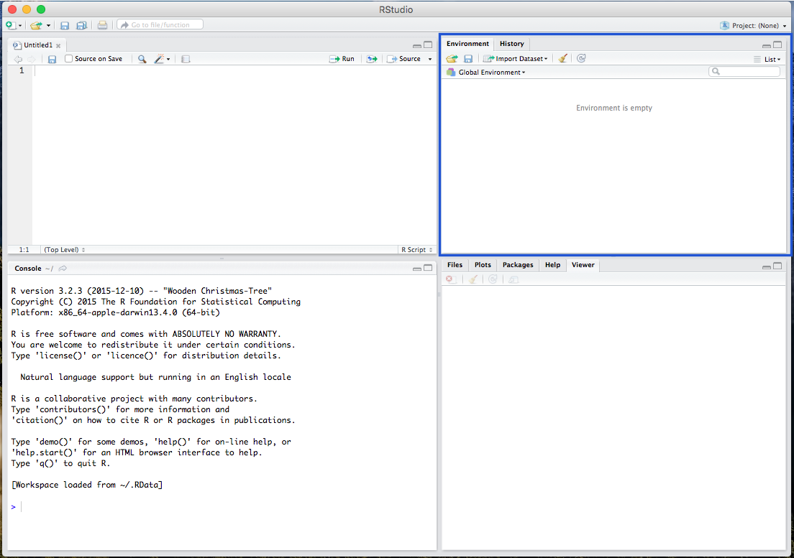

<br>

###### Getting RStudio Up and Running
* [**Installing R/RStudio**](installing.html)
* [**Getting Started with RStudio**](getting-started.html)

###### Univariate/Descriptive Statistics and Assessing Normality
* [**Univariate/Descriptive Statistics & Normality**](univariate-normality.html) [ <a href="https://raw.githubusercontent.com/burrelvannjr/gradstats_sdsu/main/resources/exercises/univariate-normality.R" target="_blank"><i>R Script</i></a> ]

###### Bivariate and Multivariate Statistics
* [**t-Test**](t-test.html) [ <a href="https://raw.githubusercontent.com/burrelvannjr/gradstats_sdsu/main/resources/exercises/t-test.R" target="_blank"><i>R Script</i></a> | [*Example*](t-test-example.html) ]
* [**Analysis of Variance (ANOVA)**](anova.html) [ <a href="https://raw.githubusercontent.com/burrelvannjr/gradstats_sdsu/main/resources/exercises/anova.R" target="_blank"><i>R Script</i></a> | [*Example*](anova-example.html) ]
* [**Chi Square**](chi-square.html) [ <a href="https://raw.githubusercontent.com/burrelvannjr/gradstats_sdsu/main/resources/exercises/chi-square.R" target="_blank"><i>R Script</i></a> | [*Example*](chi-square-example.html) ]
* [**Correlation**](correlation.html) [ <a href="https://raw.githubusercontent.com/burrelvannjr/gradstats_sdsu/main/resources/exercises/correlation.R" target="_blank"><i>R Script</i></a> | [*Example*](correlation-example.html) ]
* [**Regression**](regression.html) [ <a href="https://raw.githubusercontent.com/burrelvannjr/gradstats_sdsu/main/resources/exercises/regression.R" target="_blank"><i>R Script</i></a> | [*Example*](regression-example.html) ]
<br><br>

#


### Getting Started with RStudio

Open the RStudio program, which should be linked to R.

 <br><br><br>

There are various windows within RStudio, including the Script window, where all your codes are viewable:

 <br><br><br>

The R console window where you paste and run your code:

 <br><br><br>

The Environment window, where your data and background processes are viewable:

 <br><br><br>

And the Plot/Viewer window, where your output figures/diagrams, help information, and file viewer are located:

 <br><br>


### Getting Familiar with R

#

#### Setting the Working Directory

Before running analyses, you have to set your working directory. This is the folder where your data/output is and will be saved. For example, I use the following:

```{r}
setwd("/Users/burrelvannjr/Desktop/PA606")
```

# 

This will be different for you. To set your working directory, use <span style="color:blue">`setwd("directory")`</span>, and replace the word "directory" with the *pathname* of the folder you want to be your directory (or under the **Session** menu, select **Set Working Directory**, then select **Choose Directory** and navigate to your desired folder).

#### A Note on Commenting

Througout any script, you'll also notice a line of text with a pound sign (e.g. hashtag) preceding it, like this <span style="color:green">`#this is a how to calculate a mean`</span>. This is a **comment**, which is just a note to yourself. Comments remind the user what the a bit of code is supposed to do.

#

#

#### Installing Packages and Loading as Libraries

Because R is and open-source statistical program, many of its functions are built by programmers in the form of **packages** or **libraries**. Most of these are published and hosted on the [Comprehensive R Archive Network (CRAN)](https://cran.r-project.org/) website. We will be using 3 main packages in this exercise: the <span style="color:blue">`MASS`</span>, the <span style="color:blue">`psych`</span>, and the <span style="color:blue">`car`</span>. 

```{r, echo=F}
options(repos=c(CRAN="http://cran.wustl.edu/"))
```

# 

Install the packages from the repository (copy and paste the lines below)
```{r, results="hide", warning=FALSE, message=FALSE}
install.packages("MASS")
install.packages("psych")
install.packages("car")
install.packages("devtools")
```

#

Load the packages as libraries

```{r, results="hide", warning=FALSE, message=FALSE}
library(MASS)
library(psych)
library(car)
library(devtools)
```

#

# 

Additionally, many developers create packages of their own. These packages are "In Development," and as such, aren't yet published on CRAN. These packages are extremely useful, but are often published by individual users on the software development website [GitHub](https://github.com/). We will be using one such package for this: the <span style="color:blue">`vannstats`</span> package that I developed (compiled from other packages). 

#
#
#

To access this "In Development" package on GitHub, we rely on the <span style="color:blue">`devtools`</span> to `install` and `load` the <span style="color:blue">`vannstats`</span> package from GitHub:

```{r, results="hide", warning=FALSE, message=FALSE}
devtools::install_github("burrelvannjr/vannstats")
library(vannstats)
```

#

#


#


### Working with Data 

#

#### Calculations

In R/RStudio, we can use the Script (and Console) window to make calculations. For example, we can run the following...

```{r}
3 + 2
```

#

#### The Assignment Operator for Creating Objects

#


The great thing about R is that, because it is an object-oriented programming language, you can assign **object names** to any calculation or data set. This creates a working copy of the calculation (or data set) in R's memory that you can run operations on. To do so, you simply must assign an object name using a *left arrow* (the assignment operator) like this: <span style="color:blue">`new_object <- dataset`</span>.  For example, we could run...

```{r}
x <- 3 + 2
```

... and then run...

```{r}
x
```

... which gives us the same result, but now we can run manipulations on the new object (or variable) **x**.

#

#### Creating a List as an Object

Sometimes, for quick analyses, you may need to read in a list of numbers (in your working Environment). To read in a list, you use the concatenate <span style="color:blue">`c`</span> function. You can create a list by replacing the word "LIST" from this with the actual list: <span style="color:blue">`c(LIST)`</span>. 

To create an object out of a list of numbers, we could do the following...


```{r}
list <- c(1, 6, 3, 2, 7, 4, 6, 9)
```


Now that <span style="color:blue">`list`</span> is a useable object, we can run manipulations and univariate statistics on it (described below).

```{r include = FALSE}
mean(list)
mean<-mean(list)
sd(list)
sd<-sd(list)
n<-NROW(list)
z<-1.96
se<-((sd)/(sqrt(n)))
list((mean-(z*se)),(mean+(z*se)))
```

In addition, you can use the <span style="color:blue">`c`</span> or concatenate function to manually input **columns** of data (variables) and merge them into one data frame.

Let's say someone sent you the following image:

```{r, out.width = "200px", echo=FALSE}

```


We could insert the data, one variable at a time, each as a new list object:

```{r}
race <- c("black","white","latinx","white","latinx","black","other")
income <- c(57000,85500,88000,43000,45000,91500,79000)
party <- c("democrat","democrat","independent","republican","democrat","democrat","independent")
```

Next, we can view the lists by calling the object names:

```{r}
race
income
party
```


To merge these objects together, we use the <span style="color:blue">`cbind`</span> (or column bind) function -- which converts the list into a column (variable). However, the best or more appropriate way is to merge objects into a data frame, using the <span style="color:blue">`data.frame`</span> function. 


```{r}
data <- data.frame(race,income,party)
```

And the data should now be presented as a data frame:

```{r}
data
```

#


#### Removing Objects from your Environment

Many times, we'll be working with several objects, and ultimately decide that some of them are no longer needed. In this case, we would want to tidy up our environment by removing an object. To do so, we must use the <span style="color:blue">`rm`</span> function. You can do it like this, changing the word "OBJECT" to the name of the object that you're trying to remove from the R environment: <span style="color:blue">`rm(OBJECT)`</span>. 

```{r, results="hide"}
rm(x)
```


#

#

#### Reading in CSV Data Sets

Many data sets that researchers work with come in the form of a **CSV** file. A CSV (Comma Separated Values) file is just a Microsoft Excel spreadsheet (with rows as observations and columns as variables), that is converted into CSV format. 

A CSV file must be "read" into the R environment for you to use it. To do so, you'll have to call in the CSV file (data set) with one of R's functions: the <span style="color:blue">`read.csv`</span> function. Additionally, you will have to give the CSV a new object name (using the assignment operator **<-**), so we can place it in our working environment. You can do it like this, changing the word "PATHNAME" to the pathname to the csv file you're reading into the R environment: <span style="color:blue">`data1 <- read.csv("PATHNAME.csv", header=TRUE, sep=",")`</span>. 

#

#### Working with Stock Data Sets in R

Fortunately, nearly every package in R comes with a data set that R users can use. *To see which stock data sets are installed in your version of R, use the* <span style="color:blue">`data()`</span> *function.* The <span style="color:blue">`MASS`</span> package, for example, comes with a great data set on car manufacturers called <span style="color:blue;background:none">`mtcars`</span>. To use this <span style="color:blue">`mtcars`</span> data set, you must call it. Calling the data will load it into your console window. To call a stock data set, just type in the name of the data set (*Note: The data set you're calling must come from a package that is already LOADED into your R session*). Because the <span style="color:blue;background:none">`MASS`</span> package is already loaded, we can call our <span style="color:blue;background:none">`mtcars`</span> data set as such...

```{r}
mtcars
```

# 

While this is great, and the dataset is loaded into your console window, you will need a local copy to run operations on. To create a local copy (an object) so that you can run manipulations on the <span style="color:blue">`mtcars`</span> data, you should create a new object, like this:

```{r}
data1 <- mtcars
```

# 


    
# 

Like above, you can now call <span style="color:blue">`data1`</span>, and it will load the same data set into your console window (not shown here). In addition, in RStudio, after you give the data a new name (converting it to a usable object), you can view the data in your upper-right **Environment** window.

# 

#### Calling information for a Variable


To call a specific *variable* or column within the data set, you simply use the dollar sign operator <span style="color:blue">`$`</span>, in the form of <span style="color:blue">`data$variable`</span>. To call the <span style="color:blue">`mpg`</span> variable from the new <span style="color:blue">`data1`</span> data set, we use the following.

```{r}
data1$mpg
```


#

# 

### Recoding Values within a Variable

If we wanted to recode values of a variable, we could do so using the <span style="color:blue">`recode`</span> function within the `car` package. Using the recode function, we need the name of the new variable we want to place in the data set, the name of the old variable we want to recode, and the recoded values.

Let's say we wanted to recode the `cyl` variable. 

```{r}
unique(data1$cyl)
```

As can be seen, it currently has 3 unique values: 4, 6, and 8, which represent cars that are 4-cylinder, 6-cylinder, and 8-cylinder vehicles. Let's recode it into a binary variable (0,1) representing *whether or not* the car is a gas guzzler. 


```{r}
data1$gas_guzzler <- recode(data1$cyl, "4= 0; 6 = 1; 8 = 1")
```

As can be seen above, I've recoded the `cyl` variable into a new variable called `gas_guzzler`. As we can see, any observation (car) that is a 4-cylinder (has a value of 4 on the `cyl` variable) or a 6-cylinder (has a value of 6 on the `cyl` variable), was recoded as 0 on the new `gas_guzzler` variable. This means it is *not* a gas guzzler. Additionally, any observation (car) that is an 8-cylinder (has a value of 8 on the `cyl` variable) was recoded as 1 on the new `gas_guzzler` variable, meaning that it *is* a gas guzzler. 

Importantly, any additional values that exist in the `cyl` variable, that you did not specify with a recode value, will be given an `NA` (missing) value. 

```{r}
unique(data1$gas_guzzler)
```

As seen above, we've successfully recoded this variable, from 3 unique values in the `cyl` variable, to 2 unique values in the `gas_guzzler` variable. 

#

#

Additionally, you can use several different calls within the recode function. Including the:
concatenate (`c()`) function to create a list of values to recode, the `lo:` function (where you tell R to recode from the lowest value to whatever value follows the colon), the `:hi` function (where you tell R to recode from whatever value precedes the colon to the highest value), and the `else` function to recode everything else you missed as a specific value (rather than an `NA` missing value). 

#

```
data1$type <- recode(data1$cyl, "c(4,6) = 0; 8 = 1")
data1$type2 <- recode(data1$cyl, "lo:6 = 0; 8:hi = 1")
data1$type3 <- recode(data1$cyl, "4 = 0; 6 = 0; 8 = 1; else = 1")
```


#
#

### R for Data Science

For anyone interested in learning R from the ground, up, for data science, a great resource is [R for Data Science](https://r4ds.had.co.nz/index.html)


<br><br><br>