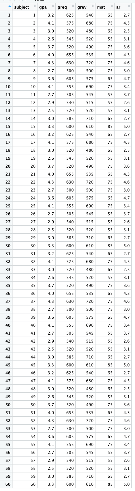

<br>

###### Getting RStudio Up and Running
* [**Installing R/RStudio**](installing.html)
* [**Getting Started with RStudio**](getting-started.html)

###### Univariate/Descriptive Statistics and Assessing Normality
* [**Univariate/Descriptive Statistics & Normality**](univariate-normality.html) [ <a href="https://raw.githubusercontent.com/burrelvannjr/gradstats_sdsu/main/resources/exercises/univariate-normality.R" target="_blank"><i>R Script</i></a> ]

###### Bivariate and Multivariate Statistics
* [**Independent Samples t-Test**](t-test.html) [ <a href="https://raw.githubusercontent.com/burrelvannjr/gradstats_sdsu/main/resources/exercises/t-test.R" target="_blank"><i>R Script</i></a> | [*Example*](t-test-example.html) ]
* [**One-Way Analysis of Variance (ANOVA)**](anova.html) [ <a href="https://raw.githubusercontent.com/burrelvannjr/gradstats_sdsu/main/resources/exercises/anova.R" target="_blank"><i>R Script</i></a> | [*Example*](anova-example.html) ]
* [**Chi Square Test of Independence**](chi-square.html) [ <a href="https://raw.githubusercontent.com/burrelvannjr/gradstats_sdsu/main/resources/exercises/chi-square.R" target="_blank"><i>R Script</i></a> | [*Example*](chi-square-example.html) ]
* [**Correlation**](correlation.html) [ <a href="https://raw.githubusercontent.com/burrelvannjr/gradstats_sdsu/main/resources/exercises/correlation.R" target="_blank"><i>R Script</i></a> | [*Example*](correlation-example.html) ]
* [**Regression**](regression.html) [ <a href="https://raw.githubusercontent.com/burrelvannjr/gradstats_sdsu/main/resources/exercises/regression.R" target="_blank"><i>R Script</i></a> | [*Example*](regression-example.html) ]
<br><br>


#### Can we predict/explain variation in a person's graduate school GPA from a variety of pre-graduate school factors?


<br>


### What is the Regression?

The OLS regression examines the predictive relationship between some independent variable(s), and an interval-ratio dependent variable. The test tells us about the effect (slope) of any independent (X) variable on an interval-ratio dependent (Y) variable. In particular, the regression equation looks at how values of an x variable "predict" a specific Y value.

For this example, the OLS regression works well because we're looking at how variation in a person's graduate school GPA (`gpa`, an interval-ratio variable ranging from 2.5 to 4.3) can be predicted/explained by variation in four other pre-graduate school variables on which students were assessed: 

* the average rating from their recommenders (`ar`, an interval-ratio variable ranging from 2.5 to 5.0)
* their GRE-Verbal score (`grev`, an interval-ratio variable ranging from 480 to 720)
* their GRE-Quantitative score (`grev`, an interval-ratio variable ranging from 480 to 720)
* their score on the <a href="https://www.pearsonassessments.com/graduate-admissions/mat/about.html" target="_blank">Miller Analogies Test</a>, which measures their analytical thinking (`mat`, an interval-ratio variable ranging from 55 to 85)


summary(lm(gpa ~ ar + grev + mat + greq, data=data))

<br>


#### Load the Necessary Stuff

```{r, echo=F}
options(repos=c(CRAN="http://cran.wustl.edu/"))
```

```{r, results="hide", warning=FALSE, message=FALSE}
library(MASS)
library(psych)
library(vannstats)
```


<br>

#### Reading in the Data

In total, we have 60 individuals. Below, show an image of their data in a spreadsheet and list their respective scores. The data are as follows:

```{r, out.width = "200px", echo=FALSE}

```

**GPA**: <span style="color:blue">`3.2, 4.1, 3.0, 2.6, 3.7, 4.0, 4.3, 2.7, 3.6, 4.1, 2.7, 2.9, 2.5, 3.0, 3.3, 3.2, 4.1, 3.0, 2.6, 3.7, 4.0, 4.3, 2.7, 3.6, 4.1, 2.7, 2.9, 2.5, 3.0, 3.3, 3.2, 4.1, 3.0, 2.6, 3.7, 4.0, 4.3, 2.7, 3.6, 4.1, 2.7, 2.9, 2.5, 3.0, 3.3, 3.2, 4.1, 3.0, 2.6, 3.7, 4.0, 4.3, 2.7, 3.6, 4.1, 2.7, 2.9, 2.5, 3.0, 3.3`</span> 

**Average Recommender Rating**: <span style="color:blue">`2.7, 4.5, 2.5, 3.1, 3.6, 4.3, 4.6, 3.0, 4.7, 3.4, 3.7, 2.6, 3.1, 2.7, 5.0, 2.7, 4.5, 2.5, 3.1, 3.6, 4.3, 4.6, 3.0, 4.7, 3.4, 3.7, 2.6, 3.1, 2.7, 5.0, 2.7, 4.5, 2.5, 3.1, 3.6, 4.3, 4.6, 3.0, 4.7, 3.4, 3.7, 2.6, 3.1, 2.7, 5.0, 2.7, 4.5, 2.5, 3.1, 3.6, 4.3, 4.6, 3.0, 4.7, 3.4, 3.7, 2.6, 3.1, 2.7, 5.0`</span>.

**GRE Verbal Score**: <span style="color:blue">`540, 680, 480, 520, 490, 535, 720, 500, 575, 690, 545, 515, 520, 710, 610, 540, 680, 480, 520, 490, 535, 720, 500, 575, 690, 545, 515, 520, 710, 610, 540, 680, 480, 520, 490, 535, 720, 500, 575, 690, 545, 515, 520, 710, 610, 540, 680, 480, 520, 490, 535, 720, 500, 575, 690, 545, 515, 520, 710, 610`</span>.

**GRE Quantitative Score**: <span style="color:blue">`625, 575, 520, 545, 520, 655, 630, 500, 605, 555, 505, 540, 520, 585, 600, 625, 575, 520, 545, 520, 655, 630, 500, 605, 555, 505, 540, 520, 585, 600, 625, 575, 520, 545, 520, 655, 630, 500, 605, 555, 505, 540, 520, 585, 600, 625, 575, 520, 545, 520, 655, 630, 500, 605, 555, 505, 540, 520, 585, 600`</span>.

**Miller Analogies Test Score**: <span style="color:blue">`65, 75, 65, 55, 75, 65, 75, 75, 65, 75, 55, 55, 55, 65, 85, 65, 75, 65, 55, 75, 65, 75, 75, 65, 75, 55, 55, 55, 65, 85, 65, 75, 65, 55, 75, 65, 75, 75, 65, 75, 55, 55, 55, 65, 85, 65, 75, 65, 55, 75, 65, 75, 75, 65, 75, 55, 55, 55, 65, 85`</span>.

<br>


As in the [Intro to R](Intro-and-Univariate-Statistics.html) vignette, we can create an object out of a list of numbers using the concatenate <span style="color:blue">`c`</span> function.

Knowing that we have five variables, we have to read in the variables separately (listing the values for each observation). To do so, we can use the following code:


```{r}
gpa <- c(3.2, 4.1, 3.0, 2.6, 3.7, 4.0, 4.3, 2.7, 3.6, 4.1, 2.7, 2.9, 2.5, 3.0, 3.3, 3.2, 4.1, 3.0, 2.6, 3.7, 4.0, 4.3, 2.7, 3.6, 4.1, 2.7, 2.9, 2.5, 3.0, 3.3, 3.2, 4.1, 3.0, 2.6, 3.7, 4.0, 4.3, 2.7, 3.6, 4.1, 2.7, 2.9, 2.5, 3.0, 3.3, 3.2, 4.1, 3.0, 2.6, 3.7, 4.0, 4.3, 2.7, 3.6, 4.1, 2.7, 2.9, 2.5, 3.0, 3.3)

ar <- c(2.7, 4.5, 2.5, 3.1, 3.6, 4.3, 4.6, 3.0, 4.7, 3.4, 3.7, 2.6, 3.1, 2.7, 5.0, 2.7, 4.5, 2.5, 3.1, 3.6, 4.3, 4.6, 3.0, 4.7, 3.4, 3.7, 2.6, 3.1, 2.7, 5.0, 2.7, 4.5, 2.5, 3.1, 3.6, 4.3, 4.6, 3.0, 4.7, 3.4, 3.7, 2.6, 3.1, 2.7, 5.0, 2.7, 4.5, 2.5, 3.1, 3.6, 4.3, 4.6, 3.0, 4.7, 3.4, 3.7, 2.6, 3.1, 2.7, 5.0)

grev <- c(540, 680, 480, 520, 490, 535, 720, 500, 575, 690, 545, 515, 520, 710, 610, 540, 680, 480, 520, 490, 535, 720, 500, 575, 690, 545, 515, 520, 710, 610, 540, 680, 480, 520, 490, 535, 720, 500, 575, 690, 545, 515, 520, 710, 610, 540, 680, 480, 520, 490, 535, 720, 500, 575, 690, 545, 515, 520, 710, 610)

greq <- c(625, 575, 520, 545, 520, 655, 630, 500, 605, 555, 505, 540, 520, 585, 600, 625, 575, 520, 545, 520, 655, 630, 500, 605, 555, 505, 540, 520, 585, 600, 625, 575, 520, 545, 520, 655, 630, 500, 605, 555, 505, 540, 520, 585, 600, 625, 575, 520, 545, 520, 655, 630, 500, 605, 555, 505, 540, 520, 585, 600)

mat <- c(65, 75, 65, 55, 75, 65, 75, 75, 65, 75, 55, 55, 55, 65, 85, 65, 75, 65, 55, 75, 65, 75, 75, 65, 75, 55, 55, 55, 65, 85, 65, 75, 65, 55, 75, 65, 75, 75, 65, 75, 55, 55, 55, 65, 85, 65, 75, 65, 55, 75, 65, 75, 75, 65, 75, 55, 55, 55, 65, 85)
```


Where the first number in each list corresponds with the number in the first observation . For example, the first observation in the list for <span style="color:blue">`gpa`</span> is <span style="color:blue">`3.2`</span>, which corresponds with the first observation in the <span style="color:blue">`mat`</span> list, of <span style="color:blue">`65`</span>. 


Next, to appropriately prepare the data for analysis, we have to merge these five lists. To merge, as in the [Intro to R](Intro-and-Univariate-Statistics.html) vignette, we can use the <span style="color:blue">`data.frame`</span> function. 

```{r}
data <- data.frame(gpa, ar, grev, greq, mat)
```

Now we can call the data... 

```{r}
data
```

<br>

#### Assumptions and Diagnostics for Regression

The assumptions for the regression are...

* Adequate Sample Size
* Absence of Outliers
* Absence of Multicollinearity and Singluarity
* Linearity, Normality, and Homoscedasticity (Homogeneity of Variance)

In addition, the previously-discussed assumptions for other tests (independence of observations) is implied, since all of these bivariate tests require random samples. Beyond this, the OLS regression requires an interval-ratio outcome variable. 


##### 1. Adequate Sample Size

* According to Green (1991), as cited in Tabachnick and Fidel (2006), adequate sample size is determined by the modified equation $N \geq 50 + 8(k)$

Where $k$ is the number of independent variables included in the regression model. 


  + <span style="color:red">Given that we have four IVs/predictor variables, the minimum number of cases to be adequate is 82 ($82 = 50 + 8(4)$). Therefore, with only 60 observations in the data set, we do not have enough cases to adequately run the regression model. That is, `we have violated (not met) the assumption of adequate sample size`. In almost all cases, I would advise not proceeding with the regression model, however, given that this is an example, I will proceed.</span>

<br>

##### 2. Absence of Outliers

To identify outliers, simply look at the *boxplots* for each variable in the model (Y and all Xs) to see "how outlying, these outliers are." In most cases, outliers should remain in the data. Need strong justification for removing outlying cases.

```{r}
box(data, gpa)
```

```{r}
box(data, ar)
```

```{r}
box(data, grev)
```

```{r}
box(data, greq)
```

```{r}
box(data, mat)
```


  + <span style="color:red">We can see from the boxplots that the distributions of the variables are relatively normal, with no outliers. Therefore, `we have met the assumption of absence of outliers`.  Interestingly, the boxplot for the GRE Verbal variable has the median is closer to the 25th percentile. Equally as interesting, the boxplot for the Miller Analogies Test variable is missing a lower whisker, indicating that the lowest extreme case is similar to/the same as the 25th percentile case.</span> 
  
<br>

##### 3. Multicollinearity and Singularity
* Multicollinearity: Independent variables (more) highly correlated with one another (compared to their correlation with the DV).

  + Check the correlation matrix for variables.

```{r}
cormat(data, gpa ~ ar + grev + mat + greq)
```

  + <span style="color:red">We can see from the correlation matrix that none of the bivariate relationships between the independent variables (`ar`, `grev`, `mat`, `greq`) are *above* a correlation coefficient of $r \approx .90$. Therefore, `we have met the assumption of absence of multicollinearity`.</span> 
  
<br>

* Singularity: If independent variables included are (together) all possible subsets of measure also included in model. 

  + Look at the items and determine if they are subsets of other items also included. 

<br>

  + <span style="color:red">Based on the data, none of the independent variables are subsets of one another. While the GRE Verbal and the GRE Quantitative are subsets of the larger GRE, they would only count as singularity if we also included an overall or summative GRE score that was made up of the scores for the GRE Verbal and the GRE Quantitative. As such, `we have met the assumption of absence of singularity`.</span> 
  
<br>
  

##### 4. Linearity, Normality, and Homoskedasticity
* Linearity: Variables move together in a linear fashion.
* Normality: Variables are normally-distributed.
* Homoskedasticity: Homogeneity of Variance - Variance of variables are similar (10:1, 3:1 for SDs).
  + Visual inspection of **Residuals Plot** to see if relationship is linear, normal, and similar variances. Plot should have **points that extend beyond both sides of the 0 line** (normality), **should not have a U or inverted-U shape in the points** (linearity), and it **should not have a funnel shape**, where points are tightly clustered near the 0 line at one end of the plot, and completely dispersed along y-axis at other end of plot (homoskedasticity).


```{r}
residplot(data, gpa ~ ar + grev + mat + greq)
```


  + <span style="color:red">Based on the residuals plot (the difference between the actual $Y$ and the $\hat{Y}$), we see that `we have met the assumptions of linearity, normality, and homoskedasticity`. Linearity is met given that the residuals do not exhibit a non-linear (e.g. curvilinear) relationship about the 0 distance (from $\hat{Y}$) line. Normality is met given that the residuals do not have a hard stop on either side of the line -- that is, they are evenly distributed about the 0 distance (from $\hat{Y}$) line. Finally, homoskedasticity is met given that the residuals are evenly distanced from the 0 distance (from $\hat{Y}$) line at all values of $\hat{Y}$ -- as exemplified the lack of "fanning out" on one end.</span> 


<br>

### The Regression Calculation

The calculation for the Regression is:

 $\hat{Y} = b_0 + b_1X_1 + b_2X_2$
 
Where...

* $\hat{Y}$ is the predicted Y value for the combination of slopes for X values
* $b_0$ is the intercept
* $b_1$ is the slope associated with $X_1$
* $b_2$ is the slope associated with $X_2$
* $X_1$ is a specific value for the first $X$ variable that you can plug in for a specific case
* $X_2$ is a specific value for the second $X$ variable that you can plug in for a specific case

 


<br>

### Running the Regression


For Regression, within the <span style="color:blue">`lm`</span> function, which stands for *linear model*, the dependent variable is listed first and the independent variable is listed second. 


```{r, results="hide"}
lm(gpa ~ ar + grev + mat + greq, data=data)
```

This may seem confusing, so it's best to wrap our <span style="color:blue">`lm`</span> function in a <span style="color:blue">`summary`</span> call... 

```{r}
summary(lm(gpa ~ ar + grev + mat + greq, data=data))
```

To interpret the findings, we report the following information:

* The test used
* The variables used in the full model
* For significant variables, how a variable's slope affects the outcome
* The amount of variance in the outcome explained by the combination of IVs.


  + <span style="color:red">In the output above, using an OLS regression, we see the Y-intercept is a GPA value of -1.738. This is the predicted value of Y ($\hat{Y}$) when all of the $X$ values equal zero. We see that the regression coefficient - $b$ - (AKA slope) for the variables `grev`, `mat`, and `greq` are all positively and significantly related to the outcome variable. First, GRE Verbal score, net of all other variables, is significant and positively related to GPA, such that for every 1-unit increase in a person's GRE Verbal score, there is an associated (predicted) **001524-unit increase** in their GPA. Considering the Miller Analogies Test, which is significant and positively related to GPA, net of all other variables in the model, for every 1-unit increase in a person's Miller Analogies Test score, there is an associated  **.020896-unit increase** in their GPA. Finally, GRE Quantitative score is significant and positively related to GPA, when controlling for all other variables, such that for every 1-unit increase in a person's GRE Quantitative score, there is an associated  **003998-unit increase** in their GPA. Beyond this, we see that the Recommender's Average Rating for a student is non-significant in the model, and is therefore unrelated to the outcome, net of all other variables. <br><br> We also see that this model is significantly better than the null model (with no predictors), as indicated by the omnibus F test: $F(4,55) = 24.49, p\lt.05$. <br><br> Finally, for this full model, which predicts GPA from four pre-graduate school factors (`ar`, `grev`, `mat`, and `greq`), the model fit statistic, the $R^2$, is .6405.  This indicates that 64.06 percent of the variation in a person's GPA is explained by the combination of their average ratings, their GRE Verbal Score, their GRE Quantitative Score, and their score on the Miller Analogies Test. </span>


<br><br><br>
